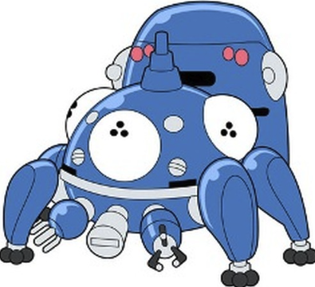
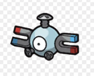

# 企画書: インターネットの裏側を学べる児童書籍

## 提案背景
- インターネットおよびネットワークは、技術とビジネス、企業同士の思惑が絡み合う面白い世界ではある。しかしその実態は、ネットワーク業界に就職した人間にしか知られていない、非常に見えづらい世界でもある。プログラマやITエンジニアであっても、実はインターネットの実態を知らない人が多く、身近にはあるものの「ブラックボックス」と化している稀有な存在である。
- ネットワーク業界で最大の悩みは、人材不足である。学生が、就職前にネットワーク業界のことを知る余地が無いため、どのネットワーク関連企業も、良い学生の獲得に四苦八苦している。「プログラマ」「ITエンジニア」と比べると、「ネットワークエンジニア」という職業の存在さえ知られてない実情がある。
- 本企画を通して、小中高生の方に「インターネットの裏側の世界」に興味をもってもらい、「ネットワークエンジニアの職業の存在意義」を認知してもらうことで、将来の人生設計や職業選択の検討材料にしていただきたい。

## 企画者: 土屋 太二について
- 36歳で、業界歴11年の現役のネットワークエンジニア
  - 過去の経歴: [Linkedin](https://www.linkedin.com/in/taiji-tsuchiya-36855479/) 
- 広島在住のフルリモートワーカー。
- 2歳半の息子の育児中。
- 副業として以下のプロジェクトに取り組む。
  - [YouTube チャンネル show int](https://www.youtube.com/@showint)
    - インターネットの裏側やネットワーク業界を知ってもらうための啓蒙活動。
    - 週一回の動画更新。現在チャンネル登録者4300名。
    - 現在３社のスポンサー企業(ネットワーク関連企業)からの資金提供を受けて運営。
  - [オライリー ネットワーク自動化とプログラマビリティ ―次世代ネットワークエンジニアのためのスキルセット 監訳](https://www.oreilly.co.jp/books/9784873119816/)
    - ネットワーク自動化という、ネットワークエンジニアの中でも知る人しか知らない技術情報の啓蒙のため、本書の日本語化の監訳として参加。
  - ネットワーク業界のカンファレンスに登壇 50回以上
    - https://github.com/taijiji/Presentations

### 企画者の想い
これまで、インターネットの裏側の世界や、ネットワークエンジニアの仕事の面白さを、いろんな人に伝えたい！という想いで、さまざまな対外活動をしてきました。
そのなかでも、以下のYouTube動画が、非常に多くの人にご視聴いただいて、特に学生さんや営業職の方、プログラマといった、ネットワーク業界ではない方からのフィードバックを多くいただきました。

[現役ネットワークエンジニアがインターネットの裏側について語ってみました(自作のYouTube動画)](https://youtu.be/fpXltBcfNeY)
  - 自作したYouTube動画です。本チャンネルで最も視聴されている動画です(1.1万回再生)。
  - 対象は高校生~大学生 ~ 新社会人
  - このテーマでカンファレンスや大学講義でやったところ、非常に好評。
  - もともとは新人ネットワークエンジニアのための勉強資料として作成しましたが、思いの外、ネットワーク業界以外の方からの反応をいただけました。
  - [動画内で利用している資料](https://docs.google.com/presentation/d/1JwXA2v45azxbBrnfYiun-9yAKCjXNODaDB7gxTmA7nc/edit?usp=sharing)

この動画で紹介した内容を、さらに中高生にも広めることができれば、将来の職業の選択肢として、インフラエンジニアの仕事に興味を持っていただける学生さんの数が増やせられるのではないかと期待しています。
中高生にも興味もっていただくためのメディアとして、小説もしくは児童書というテーマに落とし込めないかチャレンジしたい、というのが今回の企画の最大のモチベーションです。

可能であれば、これまでの個人活動では実現できなかった「世界中の人たちにも価値を届ける」という想いから、本企画の日本語書籍が成功したら、将来的に英語翻訳して世界展開までできたら最高です。 

## 企画内容

## メインターゲット層
- 小学校高学年 ~ 中学生
- コンピューターについて全く知らない子供に楽しんでもらえるように、差し絵の多い、ストーリー中心の児童書。
- 興味本位で本書を手にとって見て、気づいたらインターネットの世界について学んでいた、という姿が理想的

### タイトル候補
- インターネット・ガール

### 登場人物
- ハル (中学１年生、女の子)
  - ゲーム大好きな中学１年生の女の子。
  - あまり人付き合いが得意ではなく、友達は少ない。ただ一度仲良くなった友達とはずっとつるんで遊ぶタイプ
  - めんどくさがりで、不平不満が多い。でも一度興味がでたら、それにのめり込むタイプ。
  - 子供の頃からの幼馴染と、ずっとオンライン対戦ゲームで遊んでいる。(FortniteやSplatoonをイメージ)
  - 夜は、動画サイト(YouTubeをイメージ)で、動画めぐりにいそしんでいる。
  - 親世代や祖父母世代からみると、インターネット大好きな子供にみえるが、本人はその環境があたりまえすぎて、「インターネットを使っている」という意識もあまりない。無自覚にインターネットを使っている。
  - 挿絵イメージ
    - 佐山うらら(メタモルフォーゼの縁側)
    - ミサコ (熱血硬派くにおくん外伝リバーシティーガールズ)
    - (将来的な世界展開を見越して) なるべく日本固有の文化が出ないように、世界各国の子供(特に女の子)が共感できる個性&デザインにしたい。

|佐山うらら||ミサコ|
|---|---|---|
||||
||||

- ロボタ (仮) 
  - AIロボット、もしくは電脳ペットのような存在。
  - インターネット世界の案内人。技術解説役。
  - 一見無機質なロボットにみえるが、実は感情ゆたか。
  - ハルの不平や皮肉をさらりとかわして、強引に自分のペースで説明しだす、肝の座った性格。
  - 挿絵イメージ
    - タチコマ (攻殻機動隊)  
    - コイル (ポケットモンスター)

|タチコマ|コイル||
|---|---|---|
||||

### 概要
主人公のハルは、ゲーム大好きな中学１年生の女の子。
ハルはあまり人付き合いが得意ではなく、あまり友達が多いタイプではありません。
学校が終わるといつもまっすぐ家に帰って、遠方に住んでいる幼馴染の従兄弟とオンライン対戦ゲームで対戦にいそしんでいます。

いつも家に帰ったら、幼馴染と通話アプリで会話しながらオンライン対戦ゲーム。
夕飯の時間になったら、お母さんに怒られながらも、しぶしぶゲームを切り上げ、お風呂に入り、家族みんなで夕飯を食べます。
夜はお母さんからゲームを禁止されているので、夕飯後はいつも動画投稿サイトで人気配信者の動画を視聴します。お気に入りの配信者が3人もいるので、新しい動画の更新を欠かさずにチェックしていると、毎日大忙しです。

これがハルの日常です。自分が「インターネット」というモノを使ってるのは知ってるけど、小さい頃から身近にあったので、あって当たり前の存在です。たまに「通信障害」というものがあって使えない日があるけど、そんなのありえません！「インターネット」が無い世界なんて想像できません！「インターネットの中身がどうやってできてるか」って？そんなの、気にしたこともありません！

ある日、ハルが晩ごはんを食べ終わって、いつものように自分の部屋で大好きな動画配信者の動画を見ていました。
動画をいくつか見ていたら、いつのまにかウトウト眠ってしまいました。

ハルが目を開けたら、そこは電脳空間(仮)のような場所にいました。
「あれ、ここどこだろう？私いま夢を見ているのかな？」
周囲を見回してみたら、ある一匹の動物のようなロボットがいるのに気づきました。

ロボタ「やぁハル。」

ハル「なにアンタ。ここはどこよ？」

ロボタ「ぼくはロボタ(仮)。インターネットの世界へようこそ。」

ハル「インターネット?私がいつも使ってるやつ？私、ウトウトしてたら、いつのまにかインターネットの中に入っちゃったってこと？」

ロボタ「まぁそんなところだね。それよりさ、せっかくインターネットの世界にやってきたんだから、この世界をちょっと探検してみないかい？」

ハル「やだよ。早くおうちに返してよ。私、動画見るのに忙しいんだから。」

ロボタ「まぁまぁそう言わずに。どうせ一人じゃ道も分からなくて帰れないでしょ？せっかくだから探検につきあってよ。」

ハル「えー。しょーがないなー。ちょっとだけだよ？」

ロボタ「よしきた！それじゃあハル、インターネットの世界について少し見て回ろうか。ところで君は、インターネットがどうやって繋がってるか知ってるかい？」

ハル「えー。細かいことは知らないよ。だって、スマホのアイコンをクリックしたら、いつでもつながるよ。」

ロボタ「そうだよね。じゃあ、そのアイコンを押したときに、どうやってインターネットに繋がっているのか、通信の流れを、一緒に体験してみようか。」

ハル「えー。めんどくさいなー。」

ロボタ「まぁまぁそういわず。それでは、さっそくインターネットの世界に飛び込んでみよう！」

## カバー予定の技術領域
1. URL, IPアドレス
1. DNS, 名前解決の仕組み
1. ルーター
1. 家からWebコンテンツにつながるまでの流れ
    1. 宅内装置: wifi ~ モデム ~ 壁差し込み口
    1. アクセス網: 電柱 ~ トンネル(とう道) ~ 通信局舎
    1. ISP網: ルータ ~ ルータ
    1. IX(相互接続点)
    1. コンテンツ事業者ネットワーク: ルータ ~ サーバー
1. 通信トラフィック
    1. パケット
    1. 一日の通信トラフィック
    1. 人気イベント時の通信トラフィック
1. インターネットは一つの組織が運営しているわけじゃない
1. インターネットを支えるインフラエンジニア/ネットワークエンジニアの仕事

## 類似書籍
- [ユウと魔法のプログラミング・ノート(オライリー)](https://www.oreilly.co.jp/blog/2023/05/programming_note_trialreading.html)
  - 対象年齢は小中学生。年齢層としては本企画とほぼ同じで、解説のレベル感や挿絵のイメージが非常に近い。
  - 技術領域はプログラミングであり、インターネット関連は少なめ。差別化は可能。
  - 小中学生にとっては、インターネットの概念のほうが、プログラミングの難しい概念(変数,クラス,抽象化など)よりは簡単に学びやすいと思われる。インターネットであれば、通信の流れを一緒に覗いて体験する、というストーリーとして関連技術の概念を表現しやすいはず。
- [ルビィのぼうけん インターネットたんけん隊(翔泳社)](https://www.amazon.co.jp/dp/4798159867)
  - 対象年齢は5歳以上。
  - 幼児向けに特化されており、技術解説よりも絵本としての要素が強い。ただし絵本の内容だけで、技術の概念が学べるかというと、やや疑問。
  - 後半に、技術について遊んで学べる体験素材が用意されていて、ここが本書の肝のように感じる。ただし、技術をしっかり理解していて解説してくれる保護者の存在が不可欠であり、子供一人で学ぶには敷居が高い印象。

- [数学ガール(SBクリエイティブ)](https://www.amazon.co.jp/dp/4797341378)
  - 対象年齢は中高生であり、想定読者は近い。
  - 技術領域が数学としているので、差別化は可能。
  - 本書をきっかけに、社会人から数学が再注目されるようになったのは素晴らしい。このようなフォーマットを、インターネット業界にも巻き起こしたい。

- [ピアリング戦記 ― 日本のインターネットを繋ぐ技術者たち（ラムダノート）](https://www.lambdanote.com/products/peering)
  - 社会人向けの内容。技術解説書なので、小中学生には理解が難しい解説レベル。
  - 技術解説やネットワーク関係企業の取り組みにフォーカスした書籍。対象としてる技術内容は近い。
- [インターネットのカタチ―もろさが織り成す粘り強い世界(オーム社)](https://www.amazon.co.jp/dp/4274068242)
  - 社会人向けの内容。技術解説書なので、小中学生には理解が難しい解説レベル。
  - 技術解説やネットワーク関係企業の取り組みにフォーカスした書籍。対象としてる技術内容は近い。

