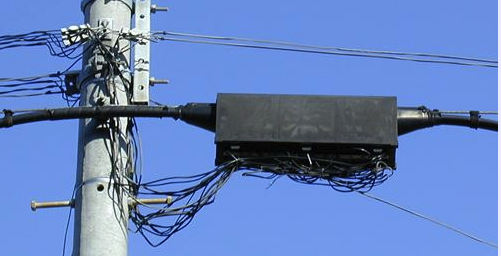
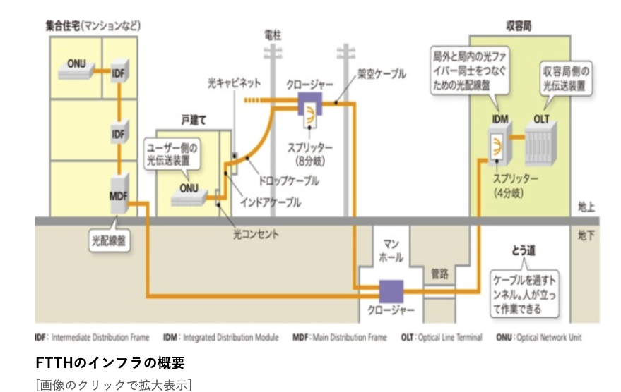

# ４節 まちのインターネットはどこに隠れている？
ハル「ここって、マンションの管理室？なんだか薄暗いところだね。」

ビット「普段だれかが住んでいるわけじゃないからね。マシンが置いてある場所なんでだいたいこんなもんさ。」

ハル「そういうもんかぁ。」

ビット「さて、次はいよいよマンションの外に出ていくよ。この光ケーブルは、次はどこに出ていくと思う？」

ハル「んー。インターネットのケーブルって、電気とか水道とか同じって言ってたよね。じゃあ、電柱とか地下を辿っていくのかな？」

ビット「正解！インターネットのケーブルは、まずは外の電柱に集まっていくんだ。」

ハル「へー、そうなんだ。電柱って、電気だけを集めているわけじゃないんだね。」

ビット「そうなんだ。光通信の場合は『クロージャー』と呼ばれる箱のようなものが電柱にぶら下がっていて、そこに光ケーブルが集められているんだ。」

https://www.wdic.org/w/WDIC/%E3%82%AF%E3%83%AD%E3%83%BC%E3%82%B8%E3%83%A3%E3%83%BC

ハル「そうなんだ。電柱に箱がついてるのに今まで全然気が付かなかった。いくつか電柱にも箱がついてるものがあるね。そこから出ている線が光ケーブルの束にってるってこと？」

ビット「そうだね。このまましばらく電線と一緒になって電柱を伝っていくよ。」

ハル「ずっと電線と一緒に進んでいくと、なんだか鳥になった気分になるね。このままずっと電柱を伝って、どこまで行くの？」

ビット「ある程度光ケーブルがたくさん集まってきたら、今度は地下に行くよ。」

ハル「地下！なんだかワクワクする！そういえば水道管もガス管も地下にあるんだもんね。」

ビット「そうそう。ある程度光ケーブルが集まって来たら、電柱からマンホールを辿っていくよ。そして地下にある通信用の管を通ってどんどん進んでいくんだ。」

https://xtech.nikkei.com/atcl/nxt/column/18/00525/112900002/  

ハル「すごい！マンホールの中って、水道だけじゃなくて、いろんなものが通っていたんだね。地下に埋まってるから、普段街を歩いててもインターネットのケーブルを見つけられなかったんだね。」

ビット「そういうこと！地域にもよるけど、インターネットのケーブルの多くは地下を進んでいくよ。そっちのほうがケーブルが切れることもなく安全だしね。ただし、いろんな事情でトンネルを掘れない地域もあるから、そういう場所は送電線と同じように電柱をたどっていくことになるよ。」

ハル「ちょっとまって。ケーブルって切れることもあるの？」

ビット「そりゃそうさ！大雪のときや地震で電柱が倒れちゃったりしたら、インターネットのケーブルなんて簡単切れちゃうよ。」

ハル「そうなんだ。家のインターネットは繋がらなくなることなんてめったにないから、ずっと使えるのがあたりまえだと思ってたよ。」

ビット「実はケーブルが一箇所切れても、インターネットが使えなくならないための工夫がいくつもされているんだ。インターネットがいつでも使えるのは、いろんな人達の工夫や努力の上で成り立っているってことだね。」

ハル「そうなんだ。インターネットを支えている人たちに感謝しないとだね。」

二人は電柱を伝ってどんどん進んでいきます。さらに電柱からマンホールにいき、地下にある細い管を辿って進んでいきます。

