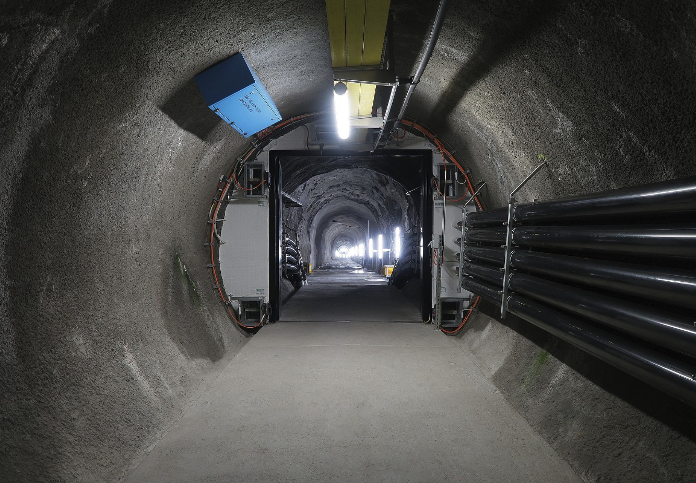

# ５節 通信局舎の世界

ハル「なんだかデカいトンネルに出たね。」

ビット「ここは『とう道』と呼ばれているよ。ここからは、人がインターネットのケーブルを管理できるように、人も通れるような大きさのトンネルになっているよ。」

https://ja.wikipedia.org/wiki/%E6%B4%9E%E9%81%93

ハル「へー。私達の足元に、こんなに大きいトンネルがあったんだね。」

